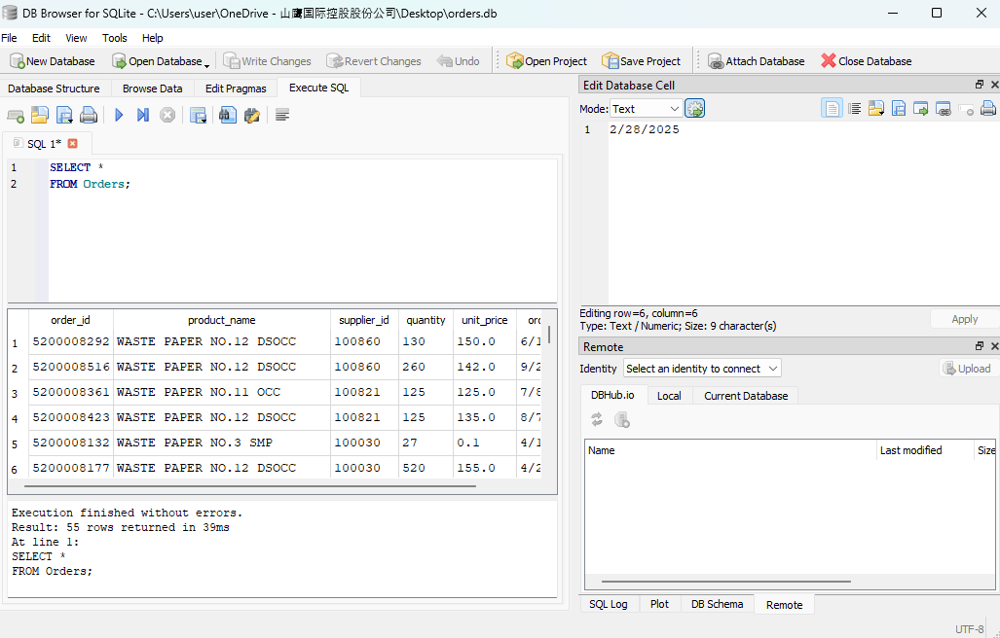
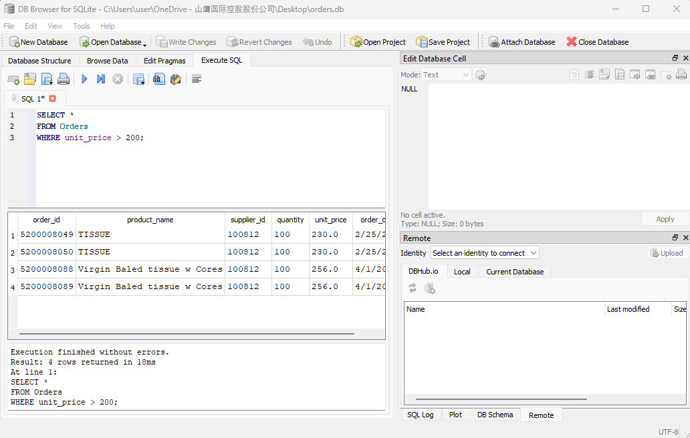
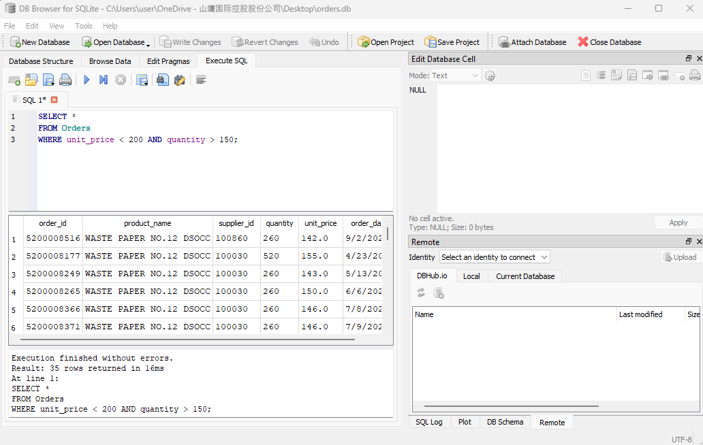
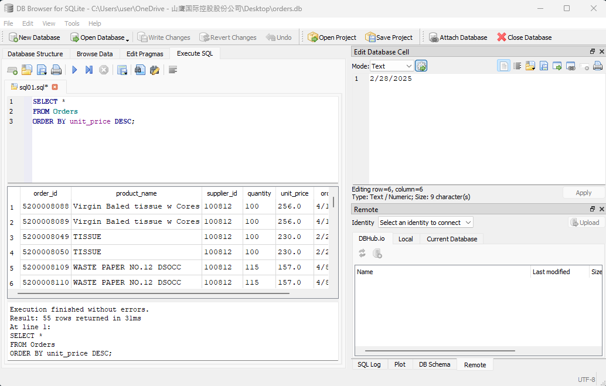
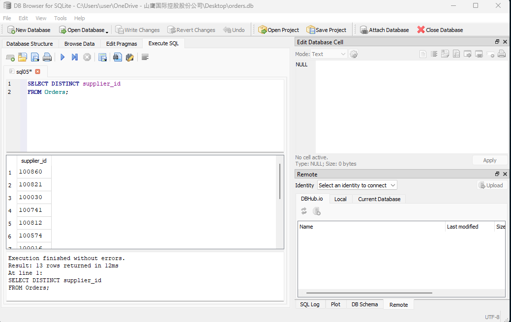
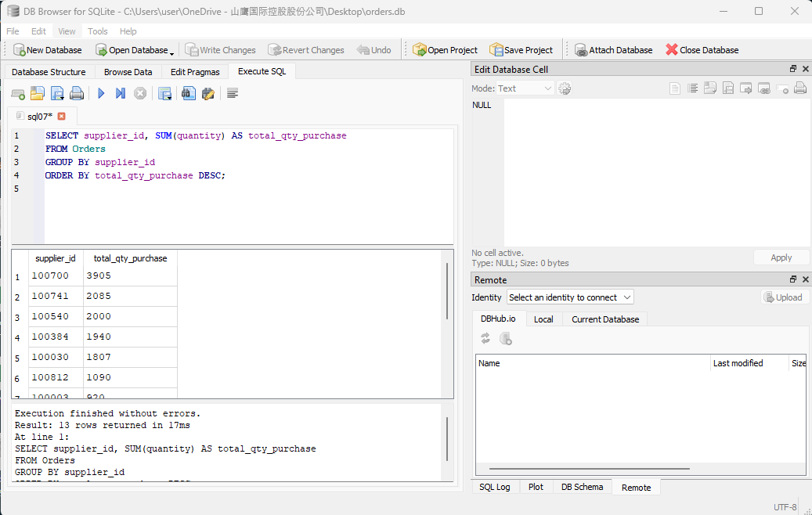
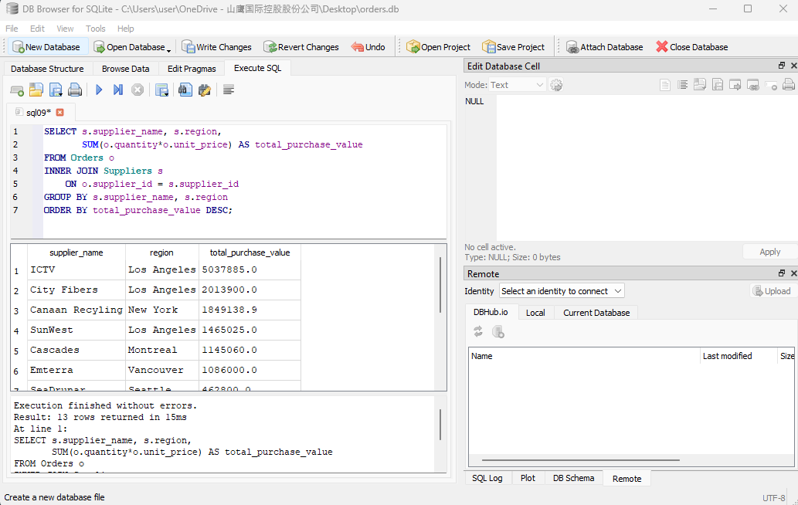
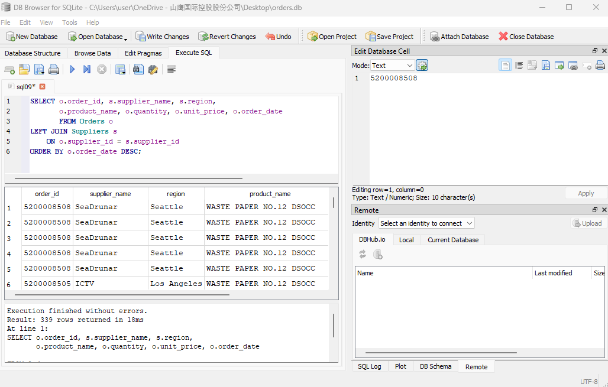
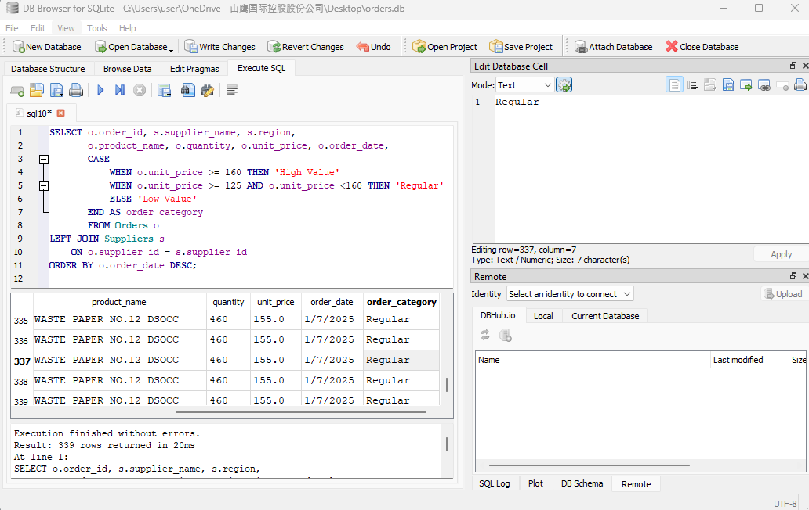

# Procurement Data Analysis with SQL

This project demonstrates my ability to analyze real procurement data using SQL.  
It simulates a supplier order management system and focuses on extracting business insights such as supplier performance, spend concentration, and material cost segmentation.

**Tools:** SQLite, DB Browser for SQLite  
**Skills:** SQL querying, data cleaning, joins, aggregation, conditional logic, and insight generation.

The project is designed as a progressive learning log, where each section builds on previous concepts — from simple filtering to business-focused analytics.


## Day 1 - Basic SELECT & WHERE

### Q01 - Check all orders
**SQL**
```sql
SELECT *
FROM Orders;
```
**Result**
- [CSV Output](outputs/result01.csv)
- 

**Insight**

Raw table inspection, confirmed data imported correctly.


### Q02 - Orders with unit_price > 200
**SQL**
```sql
SELECT *
FROM Orders
WHERE unit_price > 200;
```
**Result**
- [CSV Output](outputs/result02.csv)
- 

**Insight**

Orders with unit price greater than 200 are primarily Tissue and Virgin Baled Tissue. These represent high-value procurement items, important for tracking spending patterns and supporting the paper mill’s production formulas.


### Q03 - Orders with unit_price < 200 AND QUANTITY > 150
**SQL**
```sql
SELECT *
FROM Orders
WHERE unit_price < 200 AND QUANTITY > 150;
```
**Result**
- [CSV Output](outputs/result03.csv)
- 

**Insight**

Orders with unit price below 200 but high quantities (greater than 150) suggest bulk procurement of lower-cost materials. These are typically commodity-grade paper products purchased in large volumes to support steady production needs. Monitoring this category is important for tracking operational efficiency, negotiating bulk discounts, and identifying cost-saving opportunities in procurement.


## Day 2 - Basic Order & Grouping
### Q04 - List all orders sorted by highest unit price
**SQL**
```sql
SELECT *  
FROM Orders  
ORDER BY unit_price DESC;
```
**Result**
- [CSV Output](outputs/result04.csv)
- 

**Insight**

Sorting orders by descending unit price highlights the most expensive procurement items first. This helps quickly identify premium-grade materials (such as Virgin Baled Tissue) and monitor their impact on overall procurement costs. It is useful for spend analysis and supplier negotiations.


### Q05 - List all unique suppliers  
**SQL**
```sql
SELECT DISTINCT supplier_id  
FROM Orders;
```
**Result**
- [CSV Output](outputs/result05.csv)
- 

**Insight**

The query returns 13 unique suppliers from my current account dataset, showing the diversity within my own vendor base. This distinction is useful for monitoring supplier relationships and assessing potential dependencies, even though it does not cover the full team’s supplier pool.


### Q06 - Count total number of orders  
**SQL**
```sql
SELECT COUNT(*) AS total_orders  
FROM Orders;  
```
**Result**
- [CSV Output](outputs/result06.csv)
- 

**Insight**

The dataset contains 55 total orders from my current supplier accounts (From January 2025 to September 2025). This provides a baseline for analyzing order distribution, supplier activity, and procurement patterns.


### Q07 - Total quantity purchased per supplier (ranked)  
**SQL**
```sql
SELECT supplier_id, SUM(quantity) AS total_qty_purchase  
FROM Orders  
GROUP BY supplier_id  
ORDER BY total_qty_purchase DESC;
```
**Result**
- [CSV Output](outputs/result07.csv)
- 

**Insight**

The query ranks suppliers by total quantity purchased. Supplier 100700 accounts for the highest volume (3,905 units), followed by Supplier 100741 (2,085 units). This breakdown helps identify top-volume suppliers in my dataset, useful for evaluating supplier dependency, negotiating bulk contracts, and monitoring procurement concentration risks.


## Day 3 - INNER JOIN, LEFT JOIN, and CASE WHEN 
### Q08 - INNER JOIN Orders with Supplier
**SQL**
```sql
SELECT s.supplier_name, s.region,
       SUM(o.quantity*o.unit_price) AS total_purchase_value
FROM Orders o
INNER JOIN Suppliers s
    ON o.supplier_id = s.supplier_id
GROUP BY s.supplier_name, s.region
ORDER BY total_purchase_value DESC;	
```
**Result**
- [CSV Output](outputs/result08.csv)
- 

**Insight**

The INNER JOIN analysis shows total purchase value by supplier and region. This highlights which suppliers account for the largest share of spend, with clear visibility into procurement concentration. Identifying top suppliers in my dataset is useful for negotiating contracts, monitoring regional sourcing strategies, and managing supplier dependency risks.


### Q09 - LEFT JOIN Orders with Supplier
**SQL**
```sql
SELECT o.order_id, s.supplier_name, s.region, 
       o.product_name, o.quantity, o.unit_price, o.order_date
       FROM Orders o
LEFT JOIN Suppliers s
    ON o.supplier_id = s.supplier_id
ORDER BY o.order_date DESC;	
```
**Result**
- [CSV Output](outputs/result09.csv)
- 

**Insight**

The LEFT JOIN returns all orders in my dataset. This provides full visibility into procurement activity while also flagging missing or incomplete supplier data if any. Sorting by order date helps track recent transactions first, making it easier to spot gaps in supplier linkage and ensure data integrity in reporting.


### Q10 - Categorize orders using CASE WHEN
**SQL**
```sql
SELECT o.order_id, s.supplier_name, s.region, 
       o.product_name, o.quantity, o.unit_price, o.order_date,
	   CASE
	       WHEN o.unit_price >= 160 THEN 'High Value'
	       WHEN o.unit_price >= 125 AND o.unit_price <160 THEN 'Regular'
	       ELSE 'Low Value'
	   END AS order_category
       FROM Orders o
LEFT JOIN Suppliers s
    ON o.supplier_id = s.supplier_id
ORDER BY o.order_date DESC;
```
**Result**
- [CSV Output](outputs/result10.csv)
- 

**Insight**

The CASE WHEN logic categorizes each order as High Value, Regular, or Low Value based on unit price. This segmentation makes it easier to distinguish premium-grade purchases from routine or bulk commodity orders. Combined with supplier and region data, it supports spend analysis, helping identify which suppliers deliver high-value items versus regular stock.
